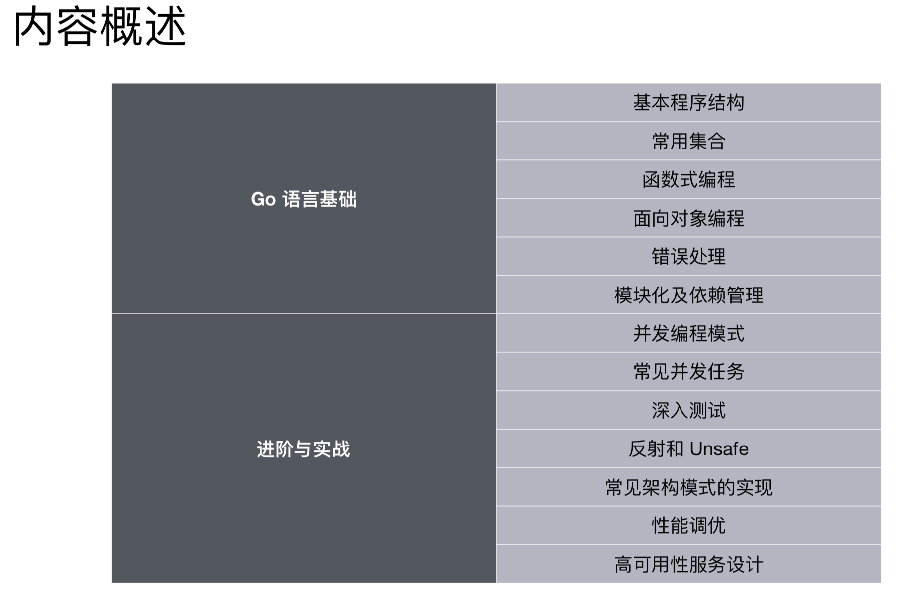
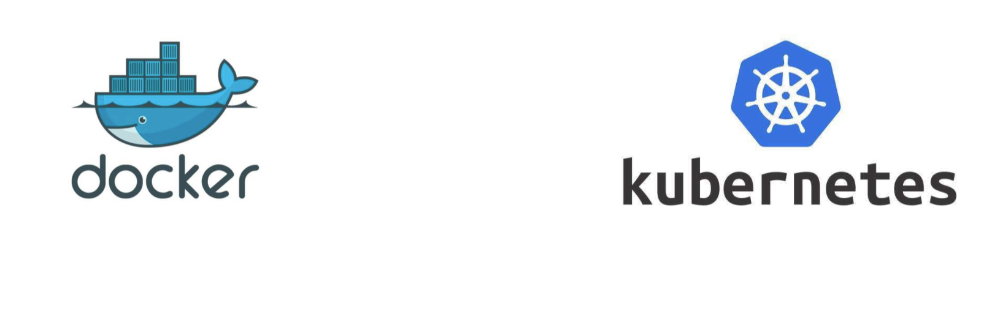
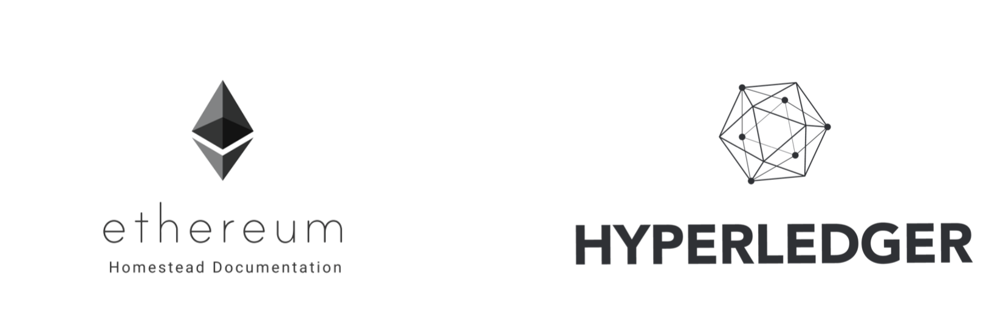

Go语言从入门到实战-I
====

## 00 概览

<div align="center">  </div><br>

## 01 Go 语⾔言简介

### 软件开发的新挑战

1. 多核硬件架构

2. 超⼤规模分布式计算集群

3. Web 模式导致的前所未有的开发规模和更更新速度

### 相比于其他语言更简单

语言|关键字对比
:---:|:---:
C|37
C++|84
Go|25

### 高效

* 垃圾回收 

* 指针

### 生产⼒

复合 vs 继承

> 没有继承，通过复合实现

### 云计算语⾔言

docker、kubernetes、Istio。。。

<div align="left">  </div><br>

### 区块链语⾔言

<div align="left">  </div><br>

## 02 准备开始 Go 冒险之旅

### 安装和 IDE

下载安装 Go 语⾔：

* [https://golang.org/doc/install](https://golang.org/doc/install)
* [https://golang.google.cn/dl/](https://golang.google.cn/dl/)

安装 IDE:推荐 GoLand

### 开发环境构建
GOPATH

1. 在 1.8 版本前必须设置这个环境变量量

2. 1.8 版本后(含 1.8)如果没有设置使⽤用默认值

	* 在 Unix 上默认为 $HOME/go ,
	* 在 Windows 上默认为 %USERPROFILE%/go 
	* 在 Mac 上 GOPATH 可以通过修改 ~/.bash_profile 来设置

### 基本程序结构

```go
package main //包，表明代码所在的模块(包) 

import "fmt" //引⼊入代码依赖

//功能实现
func main() {
  fmt.Println("Hello World!")
}
```

### 应⽤程序⼊口

1. 必须是 main 包:package main

2. 必须是 main 方法:func main()

3. ⽂件名不一定是 main.go

	**文件名可以任意，package 名也不需要和目录相同(建议保持一致)**
	
### 退出返回值

与其他主要编程语言的差异：

* Go 中 main 函数不支持任何返回值 
* **通过 os.Exit 来返回状态**

### 获取命令⾏参数

与其他主要编程语言的差异

* main 函数不持传⼊参数 

	func main**(<del>arg []string)<del>**
	
* **在程序中直接通过 os.Args 获取命令行参数**

