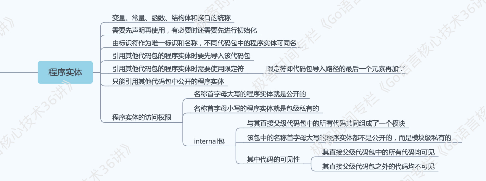

03 | 库源码文件
====

> 除了命令源码文件，你还能用 Go 语言编写库源码文件。

##### 什么是库源码文件呢？

在我的定义中，**库源码文件是不能被直接运行的源码文件，它仅用于存放程序实体，这些程序实体可以被其他代码使用（只要遵从 Go 语言规范的话）**。

这里的“其他代码”可以与被使用的程序实体在同一个源码文件内，也可以在其他源码文件，甚至其他代码包中。

> [idea]就像 Java 中定义的类和第三方依赖类一样，本身无法被直接运行（一般需要借助 main 方法），但可以被调用。

> **那么程序实体是什么呢？**
>
> 在 Go 语言中，程序实体是变量、常量、函数、结构体和接口的统称。
>
> 我们总是会先声明（或者说定义）程序实体，然后再去使用。
>
> > 比如在上一篇的例子中，我们先定义了变量name，然后在main函数中调用fmt.Printf函数的时候用到了它。

再多说一点，程序实体的名字被统称为**「标识符」**。标识符可以是任何 Unicode 编码可以表示的字母、数字以及下划线“_”，但是其首字母不能是数字。

如下图所示:



### 今天的问题是：怎样把命令源码文件中的代码拆分到其他库源码文件？

我们用代码演示，如果在某个目录下有一个命令源码文件 demo4.go，如下：

> ```go
> package main
> 
> import (
> "flag"
> )
> 
> var name string
> 
> func init() {
> 	flag.StringVar(&name, "name", "everyone", "The greeting object.")
> }
> 
> func main() {
>   flag.Parse()
>   hello(name)
> }
> ```
> 
> 其中的代码你应该比较眼熟了。在讲命令源码文件的时候贴过很相似的代码，那个源码文件名为 demo2.go。

这两个文件的不同之处在于，demo2.go 直接通过调用fmt.Printf函数打印问候语，而当前的 demo4.go 在同样位置调用了一个叫作hello的函数。

函数hello被声明在了另外一个源码文件中，我把它命名为 demo4_lib.go，并且放在与 demo4.go 相同的目录下。如下：

> ```
> // 需在此处添加代码。[1]
> 
> import "fmt"
> 
> func hello(name string) {
> fmt.Printf("Hello, %s!\n", name)
> }
> ```

那么问题来了：注释 1 处应该填入什么代码？

### 典型回答

答案很简单，填入代码包声明语句package main。

为什么？我之前说过，**在同一个目录下的源码文件都需要被声明为属于同一个代码包。**

如果该目录下有一个命令源码文件，那么为了让同在一个目录下的文件都通过编译，其他源码文件应该也声明属于main包。

> 如此一来，我们就可以运行它们了。比如，我们可以在这些文件所在的目录下运行如下命令并得到相应的结果。
> 
> ```
> $ go run demo4.go demo4_lib.go 
> Hello, everyone!
> ```
> 
> 或者，像下面这样先构建当前的代码包再运行。
> 
> ```
> $ go build puzzlers/article3/q1
> $ ./q1            
> Hello, everyone!
> ```

在这里，我把 demo4.go 和 demo4_lib.go 都放在了一个相对路径为puzzlers/article3/q1的目录中。

> 在默认情况下，相应的代码包的导入路径会与此一致。我们可以通过代码包的导入路径引用其中声明的程序实体。但是，这里的情况是不同的。

⚠️注意，demo4.go 和 demo4_lib.go 都声明自己属于main包。我在前面讲 Go 语言源码的组织方式的时候提到过这种用法，即：**源码文件声明的包名可以与其所在目录的名称不同，只要这些文件声明的包名一致就可以。**

正确的用法是，你需要把该项目的打包文件下载到本地的任意目录下，然后经解压缩后把“Golang_Puzzlers”目录加入到环境变量GOPATH中。还记得吗？这会使“Golang_Puzzlers”目录成为工作区之一。

## 问题解析
这个问题考察的是代码包声明的基本规则。

- 第一条规则，**同目录下的源码文件的代码包声明语句要一致。**也就是说，它们要同属于一个代码包。这对于所有源码文件都是适用的。

  > 如果目录中有命令源码文件，那么其他种类的源码文件也应该声明属于main包。这也是我们能够成功构建和运行它们的前提。

- 第二条规则，**源码文件声明的代码包的名称可以与其所在的目录的名称不同**。在针对代码包进行构建时，生成的结果文件的主名称与其父目录的名称一致。

  > 对于命令源码文件而言，构建生成的可执行文件的主名称会与其父目录的名称相同。

在编写真正的程序时，我们仅仅把代码拆分到几个源码文件中是不够的。我们往往会用**「模块化编程」的方式，根据代码的功能和用途把它们放置到不同的代码包中**。

> 不过，这又会牵扯进一些 Go 语言的代码组织规则。我们一起来往下看。

## 知识精讲
### 1. 怎样把命令源码文件中的代码拆分到其他代码包？

我们先不用关注拆分代码的技巧。我在这里仍然依从前面的拆分方法。我把 demo4.go 另存为 demo5.go，并放到一个相对路径为puzzlers/article3/q2的目录中。

然后我再创建一个相对路径为puzzlers/article3/q2/lib的目录，再把 demo4_lib.go 复制一份并改名为 demo5_lib.go 放到该目录中。

为了让它们通过编译，我们应该怎样修改代码？

> 我在这里给出一部分答案，我们一起来看看已经过修改的 demo5_lib.go 文件。
>
> ```go
> package lib5
> 
> import "fmt"
> 
> func Hello(name string) {
> fmt.Printf("Hello, %s!\n", name)
> }
> ```
>

可以看到，我在这里修改了两个地方。

> - 第一个改动是，我把代码包声明语句由package main改为了package lib5。注意，我故意让声明的包名与其所在的目录的名称不同。
> - 第二个改动是，我把全小写的函数名hello改为首字母大写的Hello。

基于以上改动，我们再来看下面的几个问题。

### 2. 代码包的导入路径总会与其所在目录的相对路径一致吗？

库源码文件 demo5_lib.go 所在目录的相对路径是puzzlers/article3/q2/lib，而它却声明自己属于lib5包。在这种情况下，该包的导入路径是puzzlers/article3/q2/lib，还是puzzlers/article3/q2/lib5？

> 这个问题往往会让 Go 语言的初学者们困惑，就算是用 Go 开发过程序的人也不一定清楚。我们一起来看看。

首先，我们在构建或者安装这个代码包的时候，提供给go命令的路径应该是**目录的相对路径**，就像这样：

```go
go install puzzlers/article3/q2/lib 
```

该命令会成功完成。之后，当前工作区的 pkg 子目录下会产生相应的归档文件，具体的相对路径是:

```go
pkg/darwin_amd64/puzzlers/article3/q2/lib.a
```

其中的darwin_amd64就是我在讲工作区时提到的**平台相关目录**。可以看到，这里与源码文件所在目录的相对路径是对应的。

为了进一步说明问题，我需要先对 demo5.go 做两个改动。

> - 第一个改动是，在以import为前导的代码包导入语句中加入puzzlers/article3/q2/lib，也就是试图导入这个代码包。
> 
> - 第二个改动是，把对hello函数的调用改为对lib.Hello函数的调用。其中的lib.叫做限定符，旨在指明右边的程序实体所在的代码包。不过这里与代码包导入路径的完整写法不同，只包含了路径中的最后一级lib，这与代码包声明语句中的规则一致。

现在，我们可以通过运行go run demo5.go命令试一试。错误提示会类似于下面这种。

```go
./demo5.go:5:2: imported and not used: "puzzlers/article3/q2/lib" as lib5
./demo5.go:16:2: undefined: lib
```

- 第一个错误提示的意思是，我们**导入了puzzlers/article3/q2/lib包，但没有实际使用其中的任何程序实体。这在 Go 语言中是不被允许的，在编译时就会导致失败**。

- 注意，这里还有另外一个线索，那就是“as lib5”。这说明虽然导入了代码包puzzlers/article3/q2/lib，但是使用其中的程序实体的时候应该以lib5.为限定符。这也就是第二个错误提示的原因了。Go 命令找不到lib.这个限定符对应的代码包。

##### 为什么会是这样？

根本原因就是，我们在源码文件中声明所属的代码包与其所在目录的名称不同。

⚠️请记住，**源码文件所在的目录相对于 src 目录的相对路径就是它的代码包导入路径（就是 import 中的路径），而实际使用其程序实体时给定的限定符要与它声明所属的代码包名称对应（就是程序使用时的路径，如 lib.Hello(...)）。**

有两个方式可以使上述构建成功完成。我在这里选择把 demo5_lib.go 文件中的代码包声明语句改为package lib。

**建议编程强制习惯：为了不让该代码包的使用者产生困惑，我们总是应该让声明的包名与其父目录的名称一致。**

### 3. 什么样的程序实体才可以被当前包外的代码引用？

你可能会有疑问，我为什么要把 demo5_lib.go 文件中的那个函数名称hello的首字母大写？

实际上这涉及了 Go 语言中对于程序实体访问权限的规则。

go 的程序实体访问权限|描述
:----|-----
函数名称的首字母为**大写**（相当于 public）|可以被**包外**的代码引用
函数名称的首字母为**小写**（相当于 protected）|只能被**包内**的代码引用
模块私有|internal代码包中声明的公开程序实体仅能被该代码包的**直接父包及其子包**中的代码引用

**通过名称，Go 语言把程序实体的访问权限划分为了包级私有的和公开的。**对于包级私有的程序实体，即使你导入了它所在的代码包也无法引用到它。

> 这点不同与 java 中的访问修饰符，如 private/public/protected,注意区分，特别是 internal 代码包的约定需要注意。

### 4. 对于程序实体，还有其他的访问权限规则吗？

在 Go 1.5 及后续版本中，我们可以通过创建internal代码包让一些程序实体仅仅能被当前模块中的其他代码引用。这被称为 Go 程序实体的第三种访问权限：模块级私有。

具体规则是，internal 代码包中声明的公开程序实体仅能被该代码包的直接父包及父包的子包中的代码引用。当然，引用前需要先导入这个internal包。**对于其他代码包，导入该internal包都是非法的，无法通过编译。**

> “Golang_Puzzlers”项目的puzzlers/article3/q4包中有一个简单的示例，可供你查看。你可以改动其中的代码并体会internal包的作用。

## 总结
我们在本篇文章中详细讨论了把代码从命令源码文件中拆分出来的方法，这包括拆分到其他库源码文件，以及拆分到其他代码包。

这里涉及了**几条重要的 Go 语言基本编码规则，即：代码包声明规则(建议与目录名保持一致)、代码包导入规则（函数要大写，限定符与 package一致）以及程序实体的访问权限规则（函数名大写，internal模块权限）。在进行模块化编程时，你必须记住这些规则，否则你的代码很可能无法通过编译。**

## 思考题
这次的思考题都是关于代码包导入的，如下。

1. 如果你需要导入两个代码包，而这两个代码包的导入路径的最后一级是相同的，比如：dep/lib/flag和flag，那么会产生冲突吗？
2. 如果会产生冲突，那么怎样解决这种冲突，有几种方式？

第一个问题比较简单，你一试便知。强烈建议你编写个例子，然后运行go命令构建它，并看看会有什么样的提示。

而第二个问题涉及了代码包导入语句的高级写法，你可能需要去查阅一下 Go 语言规范。

> 可以通过包别名的方式解决冲突，如果导入的包不显式使用可以采用匿名的方式导入包